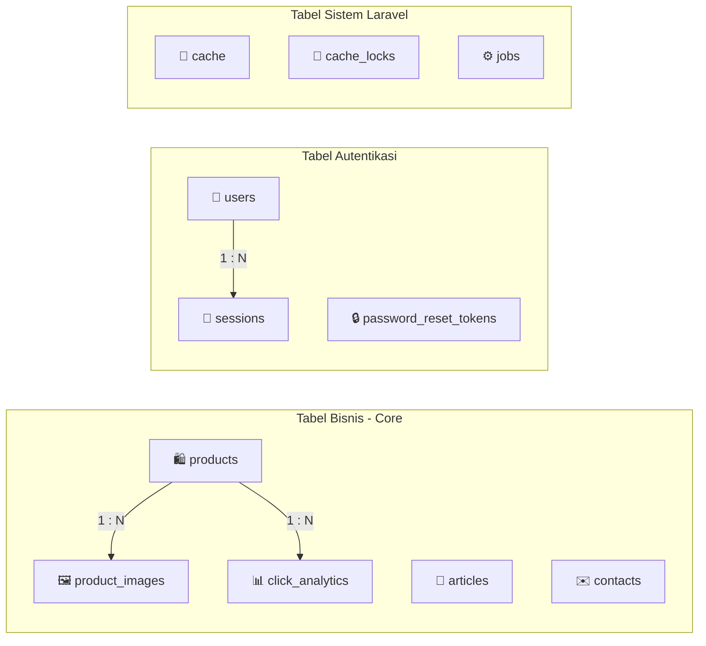

# Entity Relationship Diagram (ERD) — Ryoki Skincare

> **Database Engine:** SQLite  
> **Framework:** Laravel 12 (Eloquent ORM)  
> **Total Tabel:** 11 tabel (5 tabel bisnis + 1 tabel analitik + 5 tabel sistem Laravel)

---

## Diagram ERD

```mermaid
erDiagram
    users {
        bigint id PK "Auto Increment"
        varchar name "NOT NULL"
        varchar email UK "NOT NULL, UNIQUE"
        timestamp email_verified_at "NULLABLE"
        varchar password "NOT NULL (hashed)"
        varchar remember_token "NULLABLE"
        timestamp created_at "NULLABLE"
        timestamp updated_at "NULLABLE"
    }

    products {
        bigint id PK "Auto Increment"
        varchar name "NOT NULL"
        varchar slug UK "NOT NULL, UNIQUE"
        text description "NULLABLE"
        text usage "NULLABLE"
        text ingredients "NULLABLE"
        decimal price "10,2 — NOT NULL"
        varchar category "NOT NULL"
        varchar image "NULLABLE"
        decimal rating "2,1 — DEFAULT 0"
        int stock "UNSIGNED, DEFAULT 0"
        boolean in_stock "DEFAULT true"
        boolean is_best_seller "DEFAULT false"
        boolean is_featured "DEFAULT false"
        varchar tiktok_shop_url "NULLABLE"
        varchar shopee_url "NULLABLE"
        int sold_count "UNSIGNED, DEFAULT 0"
        int review_count "UNSIGNED, DEFAULT 0"
        timestamp created_at "NULLABLE"
        timestamp updated_at "NULLABLE"
    }

    product_images {
        bigint id PK "Auto Increment"
        bigint product_id FK "NOT NULL → products.id"
        varchar image_path "NOT NULL"
        int sort_order "DEFAULT 0"
        timestamp created_at "NULLABLE"
        timestamp updated_at "NULLABLE"
    }

    articles {
        bigint id PK "Auto Increment"
        varchar title "NOT NULL"
        varchar slug UK "NOT NULL, UNIQUE"
        text content "NOT NULL"
        text thumbnail "NULLABLE"
        boolean is_published "DEFAULT true"
        timestamp created_at "NULLABLE"
        timestamp updated_at "NULLABLE"
    }

    contacts {
        bigint id PK "Auto Increment"
        varchar name "NOT NULL"
        varchar email "NOT NULL"
        varchar phone "NULLABLE"
        text message "NOT NULL"
        boolean is_read "DEFAULT false"
        timestamp created_at "NULLABLE"
        timestamp updated_at "NULLABLE"
    }

    click_analytics {
        bigint id PK "Auto Increment"
        varchar platform "NOT NULL, INDEX"
        bigint product_id FK "NULLABLE → products.id"
        varchar product_name "NULLABLE"
        varchar button_location "DEFAULT General, INDEX"
        varchar ip_address "NULLABLE, max 45"
        text user_agent "NULLABLE"
        timestamp created_at "NULLABLE"
        timestamp updated_at "NULLABLE"
    }

    sessions {
        varchar id PK "Session ID"
        bigint user_id FK "NULLABLE → users.id, INDEX"
        varchar ip_address "NULLABLE, max 45"
        text user_agent "NULLABLE"
        longtext payload "NOT NULL"
        int last_activity "INDEX"
    }

    password_reset_tokens {
        varchar email PK "Primary Key"
        varchar token "NOT NULL"
        timestamp created_at "NULLABLE"
    }

    cache {
        varchar key PK "Primary Key"
        mediumtext value "NOT NULL"
        int expiration "INDEX"
    }

    cache_locks {
        varchar key PK "Primary Key"
        varchar owner "NOT NULL"
        int expiration "INDEX"
    }

    jobs {
        bigint id PK "Auto Increment"
        varchar queue "NOT NULL, INDEX"
        longtext payload "NOT NULL"
        tinyint attempts "UNSIGNED"
        int reserved_at "UNSIGNED, NULLABLE"
        int available_at "UNSIGNED"
        int created_at "UNSIGNED"
    }

    products ||--o{ product_images : "has many"
    products ||--o{ click_analytics : "has many"
    users ||--o{ sessions : "has many"
```

---

## Relasi Antar Tabel

---

## Detail Relasi

| Relasi | Tabel Induk | Tabel Anak | Kardinalitas | Foreign Key | Keterangan |
|--------|-------------|------------|-------------|-------------|------------|
| Product → Product Images | `products` | `product_images` | **One-to-Many** | `product_id` → `products.id` | CASCADE ON DELETE — Jika produk dihapus, semua galeri ikut terhapus |
| Product → Click Analytics | `products` | `click_analytics` | **One-to-Many** | `product_id` → `products.id` | SET NULL ON DELETE — Jika produk dihapus, record analitik tetap ada (product_id jadi NULL) |
| User → Sessions | `users` | `sessions` | **One-to-Many** | `user_id` → `users.id` | NULLABLE — Session bisa ada tanpa user (guest session) |

> **Catatan:** Tabel `articles`, `contacts`, `cache`, `cache_locks`, `jobs`, dan `password_reset_tokens` **tidak memiliki foreign key** ke tabel lain (berdiri sendiri / standalone).

---

## Spesifikasi Tabel Lengkap

### 1. Tabel `users` (Admin)

| Kolom | Tipe Data | Constraint | Keterangan |
|-------|-----------|-----------|------------|
| `id` | BIGINT UNSIGNED | PK, Auto Increment | Primary key |
| `name` | VARCHAR(255) | NOT NULL | Nama admin |
| `email` | VARCHAR(255) | NOT NULL, UNIQUE | Email login (unique) |
| `email_verified_at` | TIMESTAMP | NULLABLE | Waktu verifikasi email |
| `password` | VARCHAR(255) | NOT NULL | Password (bcrypt hashed) |
| `remember_token` | VARCHAR(100) | NULLABLE | Token "Remember Me" |
| `created_at` | TIMESTAMP | NULLABLE | Waktu dibuat |
| `updated_at` | TIMESTAMP | NULLABLE | Waktu diubah |

---

### 2. Tabel `products`

| Kolom | Tipe Data | Constraint | Keterangan |
|-------|-----------|-----------|------------|
| `id` | BIGINT UNSIGNED | PK, Auto Increment | Primary key |
| `name` | VARCHAR(255) | NOT NULL | Nama produk |
| `slug` | VARCHAR(255) | NOT NULL, UNIQUE | URL-friendly identifier untuk SEO |
| `description` | TEXT | NULLABLE | Deskripsi produk |
| `usage` | TEXT | NULLABLE | Cara pemakaian |
| `ingredients` | TEXT | NULLABLE | Kandungan bahan / ingredients |
| `price` | DECIMAL(10,2) | NOT NULL | Harga produk (Rupiah) |
| `category` | VARCHAR(255) | NOT NULL | Kategori produk (Skincare, Bodycare, dll) |
| `image` | VARCHAR(255) | NULLABLE | Path gambar utama produk |
| `rating` | DECIMAL(2,1) | DEFAULT 0 | Rating produk (0.0 – 5.0) |
| `stock` | INT UNSIGNED | DEFAULT 0 | Jumlah stok |
| `in_stock` | BOOLEAN | DEFAULT true | Status ketersediaan |
| `is_best_seller` | BOOLEAN | DEFAULT false | Tandai sebagai best seller |
| `is_featured` | BOOLEAN | DEFAULT false | Tandai sebagai produk unggulan |
| `tiktok_shop_url` | VARCHAR(255) | NULLABLE | Link TikTok Shop produk |
| `shopee_url` | VARCHAR(255) | NULLABLE | Link Shopee produk |
| `sold_count` | INT UNSIGNED | DEFAULT 0 | Jumlah terjual |
| `review_count` | INT UNSIGNED | DEFAULT 0 | Jumlah ulasan |
| `created_at` | TIMESTAMP | NULLABLE | Waktu dibuat |
| `updated_at` | TIMESTAMP | NULLABLE | Waktu diubah |

---

### 3. Tabel `product_images`

| Kolom | Tipe Data | Constraint | Keterangan |
|-------|-----------|-----------|------------|
| `id` | BIGINT UNSIGNED | PK, Auto Increment | Primary key |
| `product_id` | BIGINT UNSIGNED | FK → `products.id`, CASCADE DELETE | Referensi ke produk |
| `image_path` | VARCHAR(255) | NOT NULL | Path file gambar galeri |
| `sort_order` | INT | DEFAULT 0 | Urutan tampilan galeri |
| `created_at` | TIMESTAMP | NULLABLE | Waktu dibuat |
| `updated_at` | TIMESTAMP | NULLABLE | Waktu diubah |

---

### 4. Tabel `articles`

| Kolom | Tipe Data | Constraint | Keterangan |
|-------|-----------|-----------|------------|
| `id` | BIGINT UNSIGNED | PK, Auto Increment | Primary key |
| `title` | VARCHAR(255) | NOT NULL | Judul artikel Skinpedia |
| `slug` | VARCHAR(255) | NOT NULL, UNIQUE | URL-friendly identifier |
| `content` | TEXT | NOT NULL | Isi konten artikel (HTML) |
| `thumbnail` | TEXT | NULLABLE | Gambar thumbnail (path atau base64) |
| `is_published` | BOOLEAN | DEFAULT true | Status publikasi |
| `created_at` | TIMESTAMP | NULLABLE | Waktu dibuat |
| `updated_at` | TIMESTAMP | NULLABLE | Waktu diubah |

---

### 5. Tabel `contacts`

| Kolom | Tipe Data | Constraint | Keterangan |
|-------|-----------|-----------|------------|
| `id` | BIGINT UNSIGNED | PK, Auto Increment | Primary key |
| `name` | VARCHAR(255) | NOT NULL | Nama pengirim |
| `email` | VARCHAR(255) | NOT NULL | Email pengirim |
| `phone` | VARCHAR(255) | NULLABLE | Nomor telepon |
| `message` | TEXT | NOT NULL | Isi pesan |
| `is_read` | BOOLEAN | DEFAULT false | Status sudah dibaca oleh admin |
| `created_at` | TIMESTAMP | NULLABLE | Waktu dibuat |
| `updated_at` | TIMESTAMP | NULLABLE | Waktu diubah |

---

### 6. Tabel `click_analytics`

| Kolom | Tipe Data | Constraint | Keterangan |
|-------|-----------|-----------|------------|
| `id` | BIGINT UNSIGNED | PK, Auto Increment | Primary key |
| `platform` | VARCHAR(255) | NOT NULL, INDEX | Platform tujuan klik (shopee / tiktok / whatsapp) |
| `product_id` | BIGINT UNSIGNED | FK → `products.id`, NULLABLE, NULL ON DELETE | Referensi ke produk (opsional) |
| `product_name` | VARCHAR(255) | NULLABLE | Nama produk saat diklik (snapshot) |
| `button_location` | VARCHAR(255) | DEFAULT 'General', INDEX | Lokasi tombol yang diklik (Homepage, Product Detail, dll) |
| `ip_address` | VARCHAR(45) | NULLABLE | IP address pengunjung |
| `user_agent` | TEXT | NULLABLE | Browser user agent string |
| `created_at` | TIMESTAMP | NULLABLE | Waktu klik terjadi |
| `updated_at` | TIMESTAMP | NULLABLE | Waktu diubah |

---

### 7. Tabel `sessions`

| Kolom | Tipe Data | Constraint | Keterangan |
|-------|-----------|-----------|------------|
| `id` | VARCHAR(255) | PK | Session ID |
| `user_id` | BIGINT UNSIGNED | FK → `users.id`, NULLABLE, INDEX | User yang memiliki session |
| `ip_address` | VARCHAR(45) | NULLABLE | IP address |
| `user_agent` | TEXT | NULLABLE | Browser user agent |
| `payload` | LONGTEXT | NOT NULL | Data session ter-serialize |
| `last_activity` | INT | INDEX | Timestamp aktivitas terakhir |

---

### 8. Tabel `password_reset_tokens`

| Kolom | Tipe Data | Constraint | Keterangan |
|-------|-----------|-----------|------------|
| `email` | VARCHAR(255) | PK | Email user yang request reset |
| `token` | VARCHAR(255) | NOT NULL | Token reset password (hashed) |
| `created_at` | TIMESTAMP | NULLABLE | Waktu token dibuat |

---

### 9. Tabel `cache`

| Kolom | Tipe Data | Constraint | Keterangan |
|-------|-----------|-----------|------------|
| `key` | VARCHAR(255) | PK | Cache key identifier |
| `value` | MEDIUMTEXT | NOT NULL | Cached data (serialized) |
| `expiration` | INT | INDEX | UNIX timestamp kedaluwarsa |

---

### 10. Tabel `cache_locks`

| Kolom | Tipe Data | Constraint | Keterangan |
|-------|-----------|-----------|------------|
| `key` | VARCHAR(255) | PK | Lock key identifier |
| `owner` | VARCHAR(255) | NOT NULL | Pemilik lock (process ID) |
| `expiration` | INT | INDEX | UNIX timestamp kedaluwarsa |

---

### 11. Tabel `jobs`

| Kolom | Tipe Data | Constraint | Keterangan |
|-------|-----------|-----------|------------|
| `id` | BIGINT UNSIGNED | PK, Auto Increment | Primary key |
| `queue` | VARCHAR(255) | NOT NULL, INDEX | Nama queue |
| `payload` | LONGTEXT | NOT NULL | Data job (serialized) |
| `attempts` | TINYINT UNSIGNED | NOT NULL | Jumlah percobaan |
| `reserved_at` | INT UNSIGNED | NULLABLE | Waktu job di-reserve |
| `available_at` | INT UNSIGNED | NOT NULL | Waktu job tersedia |
| `created_at` | INT UNSIGNED | NOT NULL | Waktu job dibuat |

---

## Indeks Database

| Tabel | Kolom | Tipe Index | Keterangan |
|-------|-------|-----------|------------|
| `users` | `email` | UNIQUE | Mencegah duplikasi email admin |
| `products` | `slug` | UNIQUE | SEO-friendly URL unik per produk |
| `articles` | `slug` | UNIQUE | SEO-friendly URL unik per artikel |
| `click_analytics` | `platform` | INDEX | Query analitik per platform |
| `click_analytics` | `button_location` | INDEX | Query analitik per lokasi tombol |
| `sessions` | `user_id` | INDEX | Lookup session berdasarkan user |
| `sessions` | `last_activity` | INDEX | Garbage collection session lama |
| `cache` | `expiration` | INDEX | Pembersihan cache kedaluwarsa |
| `cache_locks` | `expiration` | INDEX | Pembersihan lock kedaluwarsa |
| `jobs` | `queue` | INDEX | Dispatch job per queue |

---

## Ringkasan Statistik

| Kategori | Jumlah |
|----------|--------|
| Total Tabel | **11** |
| Tabel Bisnis (Core) | **5** (users, products, product_images, articles, contacts) |
| Tabel Analitik | **1** (click_analytics) |
| Tabel Sistem Laravel | **5** (sessions, password_reset_tokens, cache, cache_locks, jobs) |
| Foreign Key | **3** (product_images→products, click_analytics→products, sessions→users) |
| Unique Index | **3** (users.email, products.slug, articles.slug) |
| Regular Index | **6** (click_analytics×2, sessions×2, cache, jobs) |
| Total Kolom | **81** |

---

> **Sumber:** Diambil dari 13 file migration di `database/migrations/` dan 6 model Eloquent di `app/Models/`.
